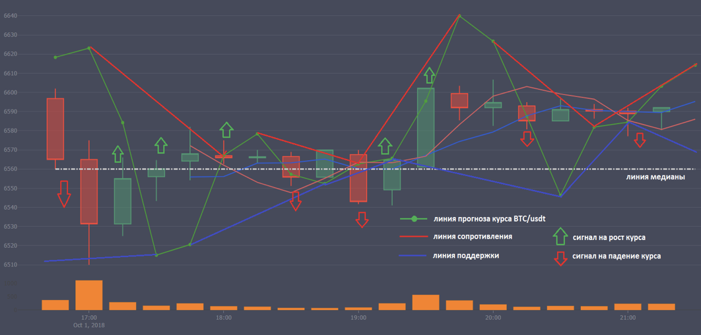
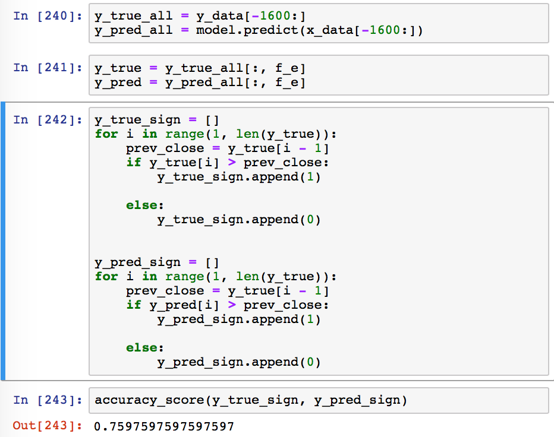
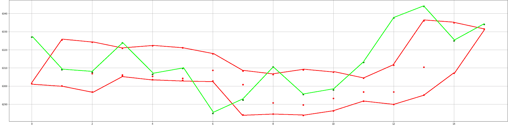
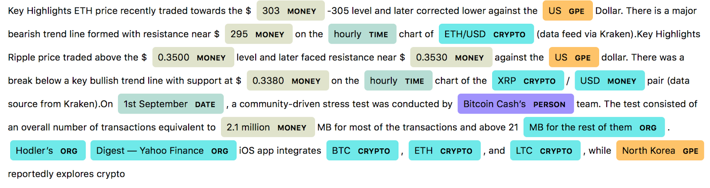
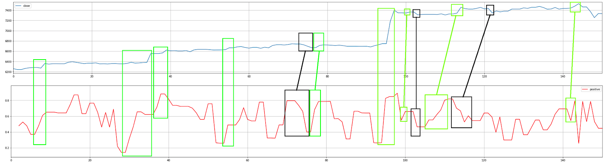

# Техническая инструкция

Нейронная сеть NeuronX в текущем моменте своего развития (альфа-версия) обучается и переобучается на датасетах свечей каждые 4 часа (используется LSTM методика в обучении нейросети), а также рассчитывает прогноз каждые 15 минут на предсказуемое движение курса биткоина.
Общий принцип текущего метода трейдинга при анализе нейросети:

- Каждые 15 минут, на основе анализа свечей, объемов строится линия: default BTC/USDT
- По верхним и нижним точкам можно построить канал такого движения (верхние максимумы и нижние минимумы – каждые 15 минут)
- Также учитывается переход свечи (вверх или вниз) за линию медианы
(средний курс – который определяется на каждый час, с учетом предыдущих максимальных и минимальных значений за предыдущие 4 часа).
- Выход курса биткоина за границы канала в аналитике NeuronX - интерпретируем, как начало неестественной манипуляции курсом и можем рассматривать такую ситуацию, как сигнал.
Если цена биткоина на предсказанном значении свечи выходит выше канала (включая тени свечи), то это сигнал покупать. Если ниже – то продавать.

# Artificial neural network
> Предсказания по свечам делаются с помощью нейронных сетей

## Анализ свечей
В системе предсказания поведения биржи мы используем в качестве accuracy такую простую метрику, как угадывание восходящего или нисходящего тренда. Как это работает: берем последовательность из настоящих close и предсказаний, начиная со 2 элемента сравниваем его с предыдущим, если он больше - ставим 1, если меньше, то ставим 0 и таким образом создаем эталонный бинарный вектор, то же самое делаем с предсказаниями (сравниваем предсказание с предыдущим настоящим значением). Теперь у нас есть 2 бинарных вектора, эталонный и предсказания и мы, используя функцию из [библиотеки](http://sklearn.metrics.accuracy_score) подсчитываем точность угадывания тренда нашего алгоритма. В качестве исходных данных мы используем 15-минутные свечи с нашего бэкенда, где данные уже обработаны. Датасет представляет ~32 тысячи свечей, отсортированных по времени, среди которых последние 5% отдаются на тест (модель никогда их не видела в обучающей выборке) и оценка качества модели проводится на этих примерах. Последняя разработанная модель показала порядка 76% точности в угадывании тренда. Для демонстрации достоверности результатов приложен фрагмент кода.

Рис.1 Пример кода для подсчета точности

На графике ниже приведен пример работы системы, зеленая линия - график close, красные точки - предсказания системы ( предсказывает сразу 3 15-минутные свечи вперед, поэтому несколько точек по вертикали может быть так как со смещением добавляется еще одно предсказание на каждую точку), красными линиями построены коридоры разброса предсказанных значений.

Рис.2 Пример работы системы на отрезке в тестовом датасете

## Новостной медиапоток
Наша команда проводит исследование и анализ медиапотока новостей и иных  социальных данных для будущего предсказания поведения рынка на этой основе или понимания прошлого. В отделе R&D на текущий момент из текста извлекаются такие важные признаки как:

- тональность (sentiment) текста (положительный, нейтральный или негативный)

- оценка значимости (частотный алгоритм) новости в рамках всех других новостей

- коэффициент распределения времени (будущее / прошлое / настоящее, суммарно равен единице)

- NER (Named Entity Recognition) - для распознавания организаций, персон, локаций, а также их подсвечивание в тексте для большего удобства пользователя

Рис.3 Пример использования NER в новостной ленте

В то же время разрабатывается алгоритм для детекции fake news:

- анализируем связь заголовка и текста

- изучаем первоисточники

- исследуем это явление в целом, всплески фейковых новостей в прошлом и их природу

- разрабатываем концепции на основе результатов исследования

- проводим синтетическое тестирование

- изучаем результаты в онлайн режиме

Предлагаем к рассмотрению такой пример, сравним агрегацию параметра positive sentiment и Close в рамках дневных свечей. Замечено, что подъемы positive sentiment сопровождаются подъемами Close через некий промежуток времени ( или даже одновременно), это говорит о том, что мы идем в верном направлении и модель, основанная на пунктах выше имеет место быть и станет очень полезным и мощным инструментом.

Зеленая разметка - характеризует подъемы, черная - падения. Синий график -close, красный - позитивная тональность новостей.

# INDICATORS

> Для определения важных сигналов мы используем различные индикаторы

## Свечные индикаторы
> Предсказания нейронной сети точны на 70%, индикаторы улучшают этот показатель определяя лучшее время для входа и выхода в рынок

### Cкорость изменения объема
По каждой валютной паре мы измеряем **Скорость изменения объема**, если она выходит за рамки среднестатистической скорости то мы считаем это сигналом

## Биржевой стакан
### Индикатор равенства объемов
- Складываем объемы ask и bid
- Выбираем меньшее число суммы объемов, к примеру у ask сумма 3000, у bid 2000 (и последний ордер в стакане по цене 6550)
- Проводим еще одно сложение пока сумма ask будет максимально близка к цене 6550. там где остановится сложение находится цена равновесная объему
- Пишем эту цену в табличку, плюс измеряем % изменения от предидущего, остальные параметры тоже записываем
- Также соотношение "цены равенства объемов" нам показывает насколько рынок находится в балансе/диссбалансе. Это изменение надо тоже записывать

### Индикатор магнитных линий
Зная усредненный объем сделок по предидущим минутным свечам, мы можем строить прогнозы по биржевому стакану:
Где окажется цена через минуту если купят этот средний объем, 2 средних объема, 3 и т.д."

# API

> Documentation for NeuronX.io

## WebSocket

- Base endpoint is: **wss://api.neuronx.io/adonis-ws**
- All symbols for streams are lowercase

### Detailed Stream information

> WIP

## REST API
> WIP