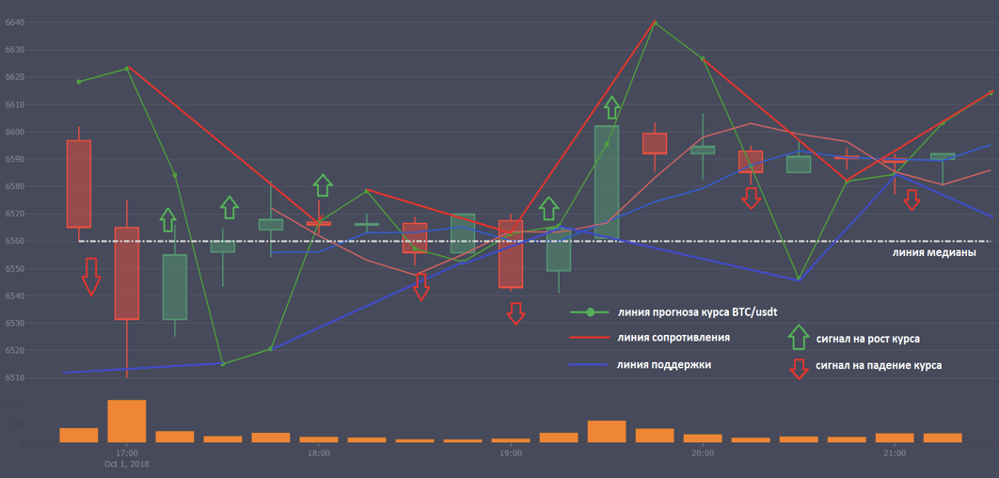
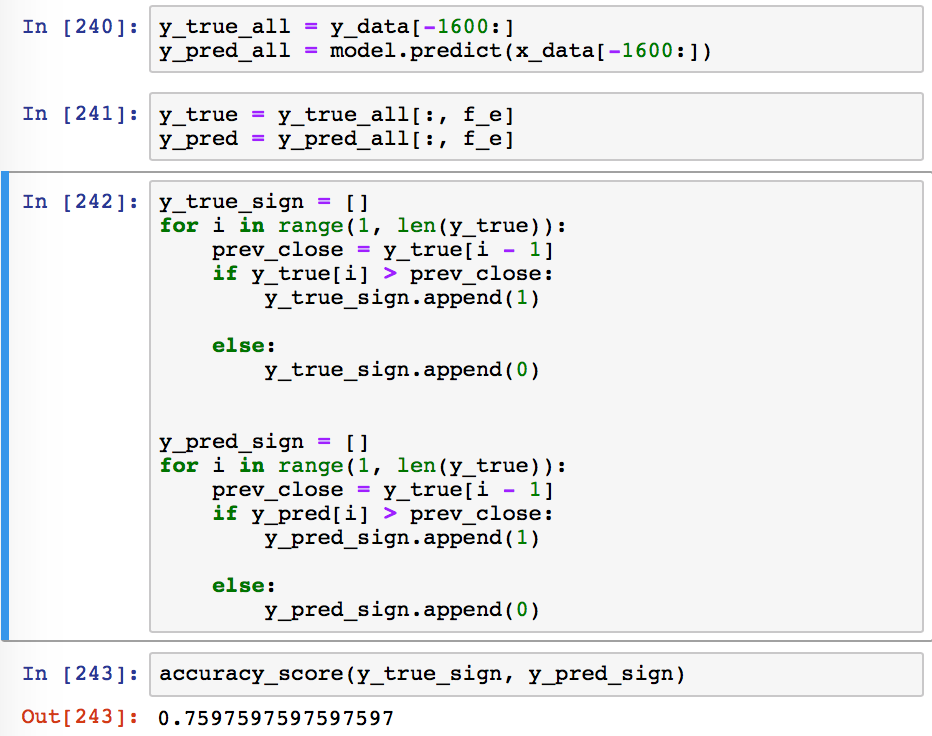
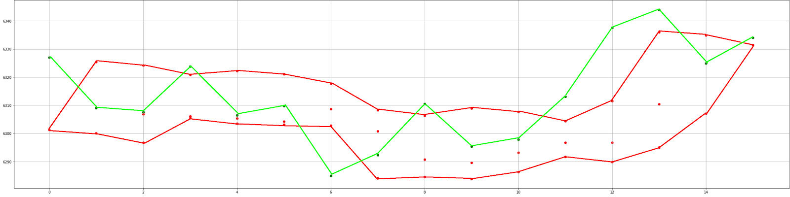
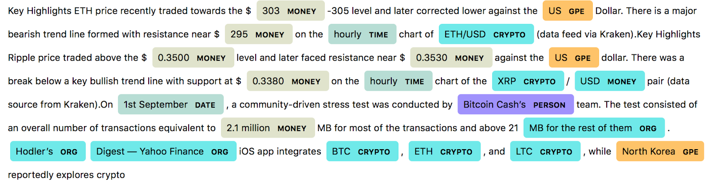
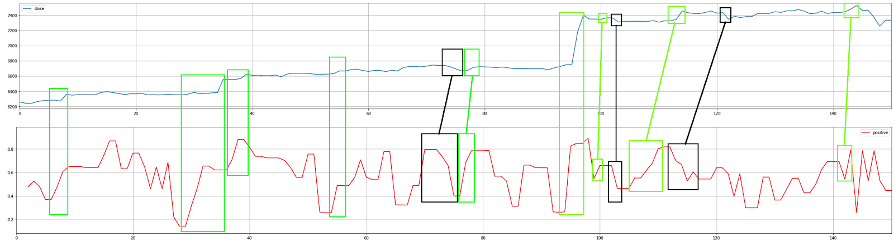

# Technical instruction

Neural network NeuronX in the current moment of its development (alpha version) is trained and retrain on data sets of candles every 4:00 (LSTM learning methodology used neural networks), and also calculates the forecast every 15 minutes on the predictable movement course bitcoin. The general principle of current trading method in the analysis of a neural network:

- Every 15 minutes, on the basis of an analysis of candles, volumes built line: default BTC/USDT
- On the top and bottom points we construct such traffic channel (highs and lows every 15 minutes)
- Consider moving the median line candles (The average rate is established on every hour, taking into account previous maximum and minimum values from the previous 4:00).
- Output currency abroad interprets as the start channel unnatural manipulation of rate and can treat this situation as a signal.
- If the price of the currency of a predicted, meaning candle goes above the channel (including shadows), then it is a signal to buy. If below-then sell.

# Artificial neural network
> Predictions on candlesticks made using neural networks

## Analysis candles
The system of predicting the behavior of Exchange we use as "accuracy" such a simple metric like guessing the upward or downward trend. How it works: take the sequence of these close and predictions, starting with 2 compare it with the previous item, if it is more-put 1, if less then put 0 and thus create a reference binary vector, do the same with predictions (compare with the previous prediction of present value). Now we have 2 binary vectors, reference and predictions and we are using a function from the [Library](http://sklearn.metrics.accuracy_score) count the precision trend guessing our algorithm. As input we use 15-minute candles with our backend, where data is already processed. The dataset is ~ 38 thousands of candles, sorted by time, among which are the last 5% is given on the test (model never saw in the learning sample) and model quality evaluation shall be carried out on these examples.

Fig. 1 example code for counting accuracy

The graph below shows an example of operation of the system, the green line - graph close, red dots-prediction system (predicts immediately 3 15-minute candles forward, so few pixels vertically may be because the offset is added to another prediction for each point), red lines built corridors spreading of predicted values.

Fig. 2 examples of a test the system after

## News media stream
Our team conducts research and analysis of media stream of news and other social data to predict future market behavior on this basis or understanding of the past. In the Department of R&D at the moment from the text are extracted such important traits as:

- Tone (sentiment) text (positive, neutral, or negative).

- Valuing (frequency algorithm) news in all the other news.

- Distribution coefficient of time (future/past/present, cumulatively equal to the unit).

- NER (Named Entity Recognition) - to recognize organizations, persons, locations, as well as their highlighting in the text for greater convenience

Fig. 3 example usage of NER in the news feed

At the same time, developed an algorithm to detect fake news:

- Analyze the header link and text.

- Study the primary sources.

- Explore this phenomenon as a whole, the news in the past fake bursts and their nature.

- Design concept on the basis of the results of the study.

- Conduct synthetic testing.

- Study results in online mode

Offer to consider such an example, compare the aggregation parameter positive sentiment and Close within a day of the candles. I've noticed that the positive sentiment rises accompanied by rises Close through some period of time (or even simultaneously), this suggests that we are moving in the right direction and a model based on the above paragraphs is the place to be and will be very useful and a powerful tool.

Green markings-characterizes rises, black-the fall. Blue graphic close, red-positive tone of news.

# INDICATORS

> To determine the important signals, we use various indicators

## Candlestick indicators
> Neural network predictions accurate to 70%, indicators improve this figure when determining the best time to enter and exit the market.

### Volume change speed
For each currency pair we measure **Volume change speed** when it goes beyond the average speed we believe this signal.

## Depth of Market 
### Equality indicator volume
- Put the volume of ask and bid.
- Choose the fewer amount of volumes, for example, ask have the sum of 3000, 2000 bid (and last order in a glass costs 6550).
- Spend another addition will ask sum as close to price 6550. where will stop the addition is price equilibrium volume.
- Write it on a plate, plus measure % change from the previous, other parameters to write
- Also the ratio of the prices of equity volumes "shows us how the market is in balance/dissbalanse. This change should also record.

### Magnetic indicator lines
Knowing the average volume of deals on last minute 3, we can build forecasts at depth of the market: Where will prove to be the price in a minute if you buy this average volume, average volume 2, 3, etc. "

# API

> Documentation for NeuronX.io

## WebSocket

- Base endpoint is: **wss://api.neuronx.io/adonis-ws**
- All symbols for streams are lowercase

### Detailed Stream information

> WIP

## REST API
> WIP